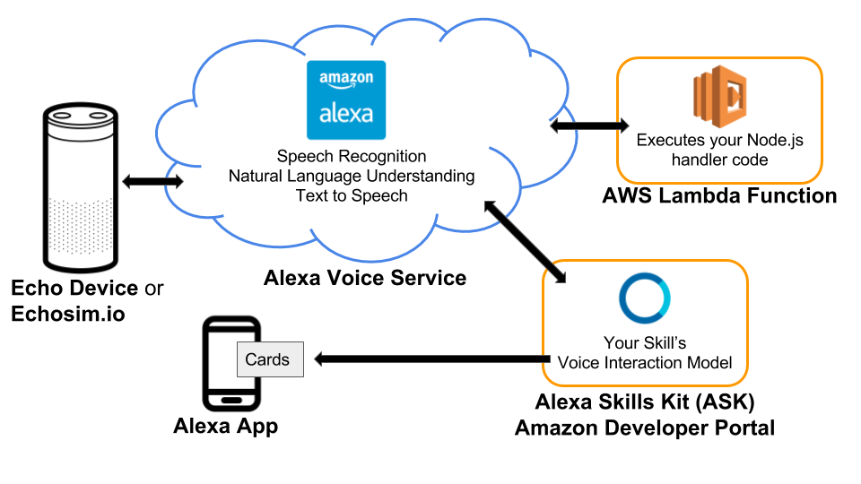

# Project: Build an Alexa History Skill

It's time to create your own Alexa Skill!.  In this project, you’ll build a fully functional skill for [Amazon’s Alexa](https://developer.amazon.com/alexa) that provides year-dated facts from AI History (or some other History of your choosing).  Through the process, you’ll get to use the [Alexa Skills Kit (ASK)](https://developer.amazon.com/alexa-skills-kit) - a current state of the art API for building voice systems.  


# Getting Started

### Set up your Amazon accounts

We highly recommend you complete the Space Geek lab in the classroom, which steps you through setting up your [Amazon Developer ](https://developer.amazon.com/alexa-skills-kit) and [Amazon AWS](https://aws.amazon.com/) accounts as well as building the project this one is based on.   If you’ve already done that, your accounts are ready to go. 
*find more detail on this in the classroom or see [Amazon's sample fact skill repo](https://github.com/alexa/skill-sample-nodejs-fact)*

### Starter Code
Install your starter code locally.
* Download or clone the [starter code](https://github.com/udacity/AIND-VUI-Alexa) from GitHub
* Save it in a directory named `AIND-VUI-Alexa`.  It contains the following directories and files:
    - **speechAssets/IntentSchema.json**  - intents definition for the interactive model
    - **speechAssets/SampleUtterances_en_US.txt** - utterances for the interactive model
    - **src/index.js** - skill logic and handlers to be run in AWS Lamda
    - **src/facts.js** - a list of facts that the skill will use in responses
    - **tests/*.js** - various unit tests to be run locally with mocha; you do not need to change these

### Environment

##### 1. Install [Node.js](https://nodejs.org/) per instructions on the website for your machine.

##### 2. Install dependencies for the project

* Navigate to the `AIND-VUI-Alexa/src` directory of the starter code and open a terminal window.  
* The dependencies we need are listed in the `package.json` file and include the [alexa-sdk](https://github.com/alexa/alexa-skills-kit-sdk-for-nodejs) library for Alexa as well as  [mocha](https://mochajs.org/) test framework for Node.js along with [chai](http://chaijs.com/) and [aws-lambda-mock-context](https://www.npmjs.com/package/aws-lambda-mock-context) for local unit testing.  Install them all with the following command:
```shell
$ npm install
```
* There should now be a directory named `node_modules` within the `src` directory.  This is how Node.js attaches libraries for your code.

##### 3. Unit testing
* You can now run the provided unit tests from the command line within the `src` directory with the following command.  Try it now:
```shell
$ npm test
```
The test code is in four parts:  "Part 1", "Part 2", "Part 3", and "Starter Code". The starter code tests should pass and all others should fail.  You may have to scroll up to see the passing tests.  As you complete the tasks ahead, you can use these unit tests (and write more yourself) to quickly test code changes prior to deployment to AWS Lambda.

##### 4. JavaScript coding
* At this point, you can open your project with a code editor of your choice.  Some free ones that support JavaScript and Node.js include [Atom](https://atom.io/) and [Visual Studio Code](https://code.visualstudio.com/)
* Udacity has a free [Intro to JavaScript](https://www.udacity.com/course/intro-to-javascript--ud803) course available that will quickly bring you up to speed on JS syntax.  The JavaScript skills needed for this project primarily require following patterns you find in the existing starter code and the use of general coding constructs such as for loops, conditional statements, and arrays. Here are a few links that might be helpful for quick reference:
    * [js for loops](https://www.w3schools.com/js/js_loop_for.asp)
    * [js conditional statements](https://www.w3schools.com/js/js_if_else.asp)
    * [js arrays](https://www.w3schools.com/js/js_arrays.asp)
    * [js String includes() method](https://www.w3schools.com/jsref/jsref_includes.asp)
    * [js JSON](https://www.w3schools.com/js/js_json.asp)
    * [Alexa skill examples](https://github.com/alexa)
    * [Node.js API reference](https://nodejs.org/dist/latest-v6.x/docs/api/)

##### 5. Run the Starter Code on AWS Lambda
* Deploy the starter code to verify that it works with your accounts in its simple form.   This is the same process you went through with the Space Geek Lab.  If you need a refresher, step-by-step instructions are provided in the classroom. 

# Evaluation

The starter code provides a simple fact skill similar to Space Geek, except a few AI history facts have been provided in an external file, `facts.js`, instead of the space facts.  Each fact includes a 4-digit year in its text, which we will use in the project for a new feature.  

The project consists of three parts:
1. Customize the fact skill
2. Add a feature using an additional intent and a slot
3. Add conversational elements

Follow the instructions for each part as described in the classroom under "Tasks" for the project.  Once all the unit tests pass, follow the submission instructions to submit your project for review!
